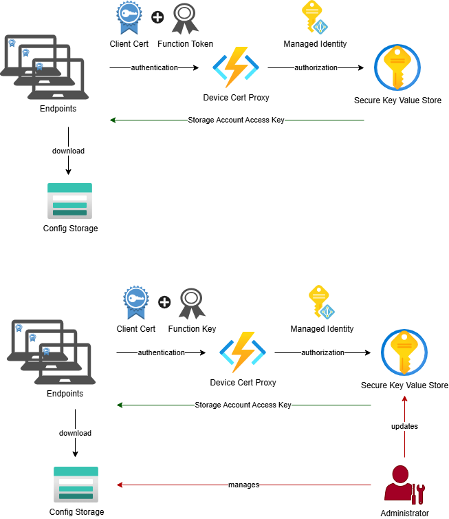

# Azure Certificate Secret Proxy

A lightweight Azure Function that delivers secrets to Windows endpoints over HTTPS with mutual TLS (mTLS). Client machines authenticate using their machine certificate; the Function validates the certificate before returning the requested secret.

## What problem does this solve?

Managed Windows endpoints often need to retrieve secrets at runtime (e.g. a storage account key, a connection string) without storing those secrets locally. This proxy lets a device prove its identity using its machine certificate — issued by your corporate CA — and receive the secret it needs in return. No secrets are stored on disk on the device.

## How it works (high level)



1. The client runs `requestSecret.ps1`, which locates the machine certificate in the Windows certificate store and calls the Azure Function over HTTPS with the cert attached.
2. Azure App Service is configured to **require** a client certificate. It terminates TLS and forwards the certificate in the `X-ARR-ClientCert` request header.
3. The Azure Function (`run.ps1`) decodes and validates the certificate:
   - **Chain validation** (if `CERT_ROOT_THUMBPRINT` is set): the cert must chain up to the uploaded Root CA.
   - **Thumbprint allowlist** (if `ALLOWED_CLIENT_CERTS` is set): the cert thumbprint must be in the list.
   - Both can be active simultaneously; the cert must then pass **both** checks.
   - At least one must be configured; otherwise the function returns HTTP 500.
4. If validation passes, the function retrieves the requested secret from the configured backend (App Settings, Key Vault, or Azure Table Storage) and returns it.

See [docs/ARCHITECTURE.md](docs/ARCHITECTURE.md) for a detailed technical walkthrough.

## Deploy to Azure

[](https://portal.azure.com/#create/Microsoft.Template/uri/https%3A%2F%2Fraw.githubusercontent.com%2Flucanoahcaprez%2FAzure-Certificate-Secret-Proxy%2Fmain%2Fdeployment%2Fazuredeploy.json/createUIDefinitionUri/https%3A%2F%2Fraw.githubusercontent.com%2Flucanoahcaprez%2FAzure-Certificate-Secret-Proxy%2Fmain%2Fdeployment%2FcreateUiDefinition.json)

The button opens a wizard in the Azure Portal that deploys all required infrastructure:

| Resource | Purpose |
|---|---|
| **Function App** (Windows, PowerShell 7.4) | Runs `run.ps1`; mTLS and HTTPS enforced at the platform level |
| **App Service Plan** | Hosts the Function App (Consumption Y1 by default) |
| **Storage Account** | Required by the Azure Functions runtime for internal state and scaling |
| **Application Insights** + **Log Analytics Workspace** | Request tracing, failure diagnosis, and live metrics |

**What the ARM template configures automatically:**

- Client certificate enforcement (`clientCertEnabled=true`, `clientCertMode=Required`)
- HTTPS-only, TLS 1.2 minimum, FTPS disabled
- System-assigned managed identity (required for the Key Vault and Table Storage workloads)
- All environment variables: `WORKLOAD`, `CERT_ROOT_THUMBPRINT`, `ALLOWED_CLIENT_CERTS`, `WEBSITE_LOAD_CERTIFICATES`, `KEYVAULT_NAME`, `TABLE_ENDPOINT`

**After the ARM deployment completes, deploy the function code:**

```powershell
func azure functionapp publish <your-function-app-name>
```

> **Certificate validation is not active until at least one of `CERT_ROOT_THUMBPRINT` or `ALLOWED_CLIENT_CERTS` is set.** Both are optional parameters in the wizard — you can provide them during deployment or set them later via the Azure Portal or [deployment/configs.azcli](deployment/configs.azcli).

> **Key Vault workload:** after deployment, grant the managed identity the `Key Vault Secrets User` role on the vault. The managed identity principal ID is shown in the deployment outputs.

See [docs/DEPLOY.md](docs/DEPLOY.md) for the full manual deployment guide, Root CA certificate upload instructions, and Key Vault RBAC setup.

## Repository structure

```
certificatesecretproxy/
  function.json                    # Azure Function trigger (HTTP GET+POST, anonymous authLevel)
  run.ps1                          # Function logic — cert validation + secret retrieval
client/
  requestSecret.ps1                # PowerShell client script for Windows endpoints
deployment/
  azuredeploy.json                 # ARM template — deploys all Azure infrastructure
  createUiDefinition.json          # Portal wizard UI for the Deploy to Azure button
  azuredeploy.parameters.json      # Sample parameter file for az CLI deployments
  configs.azcli                    # az CLI commands for post-deployment configuration
docs/
  ARCHITECTURE.md                  # Technical deep-dive: full request flow, validation logic
  DEPLOY.md                        # Step-by-step deployment and configuration guide
  TEST.md                          # Test matrix and test commands
  architecture-diagram.drawio
```

## Quick start

### Prerequisites
- Azure Function App (PowerShell worker runtime, Windows hosting plan) — or click **Deploy to Azure** above to provision everything automatically
- Machine certificates enrolled in `Cert:\LocalMachine\My` on each endpoint, issued by your corporate CA

### 1 — Deploy infrastructure (ARM template)

Use the [Deploy to Azure](#deploy-to-azure) button above, or deploy from the CLI:

```bash
az deployment group create \
  --resource-group <resource-group> \
  --template-file deployment/azuredeploy.json \
  --parameters deployment/azuredeploy.parameters.json \
               functionAppName="<your-function-app-name>"
```

### 2 — Deploy the function code

```powershell
func azure functionapp publish <your-function-app-name>
```

### 2 — Enable mTLS and HTTPS on the Function App

```bash
az functionapp update --set clientCertEnabled=true \
  -g <resource-group> -n <function-app-name>

az functionapp config appsettings set \
  -g <resource-group> -n <function-app-name> \
  --settings WEBSITE_CLIENT_CERT_MODE=Required

az functionapp update --set https_only=true \
  -g <resource-group> -n <function-app-name>
```

### 3 — Configure certificate validation

**Option A – Root CA chain validation (recommended for device fleets)**

Upload your Root CA certificate (`.cer`, no private key) in the Azure Portal:
**Function App → Certificates → Public key certificates → Upload certificate**

Then set:
```bash
az functionapp config appsettings set \
  -g <resource-group> -n <function-app-name> \
  --settings CERT_ROOT_THUMBPRINT="<ROOT_CA_THUMBPRINT>" \
             WEBSITE_LOAD_CERTIFICATES="*"
```

With this option, any device certificate signed by your CA is trusted automatically — no per-device configuration needed.

**Option B – Thumbprint allowlist (simpler, suitable for a small number of devices)**

```bash
az functionapp config appsettings set \
  -g <resource-group> -n <function-app-name> \
  --settings ALLOWED_CLIENT_CERTS="THUMB1;THUMB2;THUMB3"
```

Thumbprints must be uppercase hex strings with no spaces.

**Option C – Both (chain validation + explicit allowlist)**

Set both `CERT_ROOT_THUMBPRINT` and `ALLOWED_CLIENT_CERTS`. The certificate must pass the chain check **and** have its thumbprint in the list. This is the most restrictive mode.

### 4 — Choose a secret backend and add secrets

The `WORKLOAD` setting controls where the function looks for secrets. Pick one:

**`APPSETTINGS` (default) — secrets stored as Function App settings**

```bash
az functionapp config appsettings set \
  -g <resource-group> -n <function-app-name> \
  --settings VAR_MyStorageAccountKey="<value>" VAR_OtherSecret="<value>"
```

No `WORKLOAD` setting needed. Setting names must be prefixed with `VAR_`. The client requests `SecretName=MyStorageAccountKey` and the function looks up `VAR_MyStorageAccountKey`. This prevents accidental exposure of system or runtime settings.

**`KEYVAULT` — secrets stored in Azure Key Vault**

```bash
# Enable managed identity, then grant it the Key Vault Secrets User role (see DEPLOY.md)
az functionapp config appsettings set \
  -g <resource-group> -n <function-app-name> \
  --settings WORKLOAD=KEYVAULT KEYVAULT_NAME="<vault-name>"
```

The client passes the Key Vault secret name as `SecretName`. Secret names must use alphanumerics and hyphens only.

**`TABLE` — secrets stored in Azure Table Storage**

```bash
az functionapp config appsettings set \
  -g <resource-group> -n <function-app-name> \
  --settings WORKLOAD=TABLE \
             TABLE_ENDPOINT="https://<account>.table.core.windows.net/Secrets" \
             TABLE_SAS_TOKEN="?sv=..."
```

See [docs/DEPLOY.md](docs/DEPLOY.md) for full setup instructions for each backend.

### 5 — Call from a Windows endpoint

```powershell
# Auto-discover machine certificate by hostname (COMPUTERNAME / FQDN)
.\client\requestSecret.ps1 `
  -FunctionUrl "https://<func>.azurewebsites.net/api/certificatesecretproxy" `
  -SecretName "MyStorageAccountKey"

# Specify a thumbprint explicitly
.\client\requestSecret.ps1 `
  -FunctionUrl "https://<func>.azurewebsites.net/api/certificatesecretproxy" `
  -SecretName "MyStorageAccountKey" `
  -Thumbprint "22E4D9050A50F3ACAA6583C641BD4BE869F788CD"
```

Expected output:
```
Auto-selected certificate: CN=MYDEVICE [22E4D9050A50F3ACAA6583C641BD4BE869F788CD]
Success
SecretName : MyStorageAccountKey
SecretValue: <the-secret>
CertThumb  : 22E4D9050A50F3ACAA6583C641BD4BE869F788CD
Workload   : APPSETTINGS
```

## Client script parameters

| Parameter | Required | Description |
|---|---|---|
| `-FunctionUrl` | Yes | Full URL of the Azure Function endpoint |
| `-SecretName` | Yes | Name of the secret to retrieve |
| `-Thumbprint` | No | Explicit certificate thumbprint; skips auto-discovery |
| `-CertificatePath` | No | Path to a `.pfx` file; bypasses the Windows cert store entirely |
| `-CertificatePassword` | No | Password for the PFX file (plain text; use only for non-interactive automation) |
| `-VerboseLogging` | No | Prints certificate subject, thumbprint, and full endpoint URL before the request |

## App settings reference

| Setting | Required? | Description |
|---|---|---|
| `CERT_ROOT_THUMBPRINT` | At least one of the two must be set | Thumbprint of the Root CA uploaded to the Function App. Enables chain validation. |
| `ALLOWED_CLIENT_CERTS` | At least one of the two must be set | Semicolon-separated list of allowed client cert thumbprints (uppercase). |
| `WEBSITE_LOAD_CERTIFICATES` | Required when `CERT_ROOT_THUMBPRINT` is used | Set to `*` so the runtime loads uploaded CA certs into the Function process cert stores. |
| `WORKLOAD` | No (default: `APPSETTINGS`) | Secret backend: `APPSETTINGS`, `KEYVAULT`, or `TABLE`. For `APPSETTINGS`, secrets must be stored with a `VAR_` prefix (e.g. `VAR_MySecret`). |
| `KEYVAULT_NAME` or `KEYVAULT_URI` | Required for `KEYVAULT` workload | Key Vault name or full URI. The Function App must have a managed identity with Secret `get` permission. |
| `TABLE_ENDPOINT` | Required for `TABLE` workload | Azure Table Storage URL including table name, e.g. `https://acct.table.core.windows.net/Secrets`. |
| `TABLE_SAS_TOKEN` | Required for `TABLE` workload | SAS token string (starts with `?sv=`). Table rows must have `PartitionKey=secret`, `RowKey=<SecretName>`, `Value=<secret>`. |

## Troubleshooting

| Symptom | Likely cause | Fix |
|---|---|---|
| `SecretValue` is empty in response | Secret name does not match an app setting (or Key Vault secret / Table row) | For APPSETTINGS: verify a setting named `VAR_<SecretName>` exists. For other backends: verify the exact name. |
| HTTP 401 – "Client certificate header not found" | App Service is not forwarding the cert, or client did not send one | Confirm `clientCertEnabled=true` and `WEBSITE_CLIENT_CERT_MODE=Required`; ensure the client uses `-Certificate` |
| HTTP 401 – "Certificate chain validation failed: Root certificate … not found" | Root CA cert not loaded in Function process stores | Upload CA cert; set `WEBSITE_LOAD_CERTIFICATES=*`; restart Function App |
| HTTP 401 – "Certificate thumbprint not in whitelist" | Cert not in `ALLOWED_CLIENT_CERTS` | Add thumbprint (uppercase, no spaces) to the setting |
| HTTP 401 – "Certificate expired or not yet valid" | Machine cert outside validity window | Renew or re-enroll the machine certificate |
| HTTP 500 – "No validation method configured" | Neither `CERT_ROOT_THUMBPRINT` nor `ALLOWED_CLIENT_CERTS` is set | Configure at least one validation method |

For a full deployment walkthrough see [docs/DEPLOY.md](docs/DEPLOY.md).
For the technical request flow see [docs/ARCHITECTURE.md](docs/ARCHITECTURE.md).
